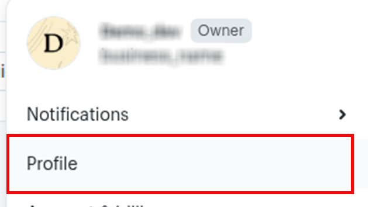

# Ballerina MailChimp Marketing Emails connector

[](https://github.com/ballerina-platform/module-ballerinax-mailchimp.marketing/actions/workflows/ci.yml)
[](https://github.com/ballerina-platform/module-ballerinax-mailchimp.marketing/commits/master)
[](https://github.com/ballerina-platform/ballerina-library/labels/module%mailchimp.marketing)

## Overview

[Mailchimp Marketing Email](https://mailchimp.com/developer/marketing/) is a powerful and user-friendly platform provided by Intuit Mailchimp, designed for creating, managing, and optimizing targeted email campaigns. It enables businesses to engage customers with personalized marketing emails, automated workflows, and insightful analytics to drive growth and build lasting relationships.

The `ballerinax/mailchimp.marketing` package provides APIs to connect and interact with the [Mailchimp Marketing API](https://mailchimp.com/developer/marketing/api/), enabling seamless integration with applications to manage marketing email sending, templates, messages, and more.


## Setup guide

1. Go to the [Mailchimp Sign Up Page](https://login.mailchimp.com/signup/) and create a Mailchimp account.

2. Once signed in, click on your profile icon in the bottom-left corner to access the account menu.

    
    

### Step 2: Generate a API Key

1. In the menu, go to **Extras** section and click on **API keys**.

    

2. Choose **Create A Key** (not the Mandril API key). You will be redirected to the API Key Generate Dashboard.

    

3. In the API Key dashboard, add a API key name and click **Generate  Key** to generate your key.

    

4. Copy the generated API key. You will need this to authenticate your connector.


## Quickstart

To use the `Mailchimp Marketing` connector in your Ballerina application, update the `.bal` file as follows:

### Step 1: Import the module

Import the `mailchimp.marketing` module.

```ballerina
import ballerinax/mailchimp.marketing;
```
### Step 2: Configure the API Key

Create a `Config.toml` file and add your API key obtained from the setup process:

```bash
mailchimpApiKey = "<your-mailchimp-marketing-access-token>"
```

### Step 3: Run the Ballerina application

```bash
bal run
```


## Examples

The `MailChimp Marketing Emails` connector provides practical examples illustrating usage in various scenarios. Explore these [examples](https://github.com/module-ballerinax-mailchimp.marketing/tree/main/examples/), covering the following use cases:

1. [List Mailchimp Audiences](https://github.com/ballerina-platform/module-ballerinax-mailchimp.marketing/tree/main/examples/list_audiences) – Fetch and display a list of all your Mailchimp audience lists.
2. [List Mailchimp Campaigns](https://github.com/ballerina-platform/module-ballerinax-mailchimp.marketing/tree/main/examples/list_campaigns) – Fetch and display a list of all campaigns from your Mailchimp account.


## Build from the source

### Setting up the prerequisites

1. Download and install Java SE Development Kit (JDK) version 21. You can download it from either of the following sources:

    * [Oracle JDK](https://www.oracle.com/java/technologies/downloads/)
    * [OpenJDK](https://adoptium.net/)

   > **Note:** After installation, remember to set the `JAVA_HOME` environment variable to the directory where JDK was installed.

2. Download and install [Ballerina Swan Lake](https://ballerina.io/).

3. Download and install [Docker](https://www.docker.com/get-started).

   > **Note**: Ensure that the Docker daemon is running before executing any tests.

4. Export Github Personal access token with read package permissions as follows,

    ```bash
    export packageUser=<Username>
    export packagePAT=<Personal access token>
    ```

### Build options

Execute the commands below to build from the source.

1. To build the package:

   ```bash
   ./gradlew clean build
   ```

2. To run the tests:

   ```bash
   ./gradlew clean test
   ```

3. To build the without the tests:

   ```bash
   ./gradlew clean build -x test
   ```

4. To run tests against different environments:

   ```bash
   ./gradlew clean test -Pgroups=<Comma separated groups/test cases>
   ```

5. To debug the package with a remote debugger:

   ```bash
   ./gradlew clean build -Pdebug=<port>
   ```

6. To debug with the Ballerina language:

   ```bash
   ./gradlew clean build -PbalJavaDebug=<port>
   ```

7. Publish the generated artifacts to the local Ballerina Central repository:

    ```bash
    ./gradlew clean build -PpublishToLocalCentral=true
    ```

8. Publish the generated artifacts to the Ballerina Central repository:

   ```bash
   ./gradlew clean build -PpublishToCentral=true
   ```

## Contribute to Ballerina

As an open-source project, Ballerina welcomes contributions from the community.

For more information, go to the [contribution guidelines](https://github.com/ballerina-platform/ballerina-lang/blob/master/CONTRIBUTING.md).

## Code of conduct

All the contributors are encouraged to read the [Ballerina Code of Conduct](https://ballerina.io/code-of-conduct).

## Useful links

* For more information go to the [`mailchimp.marketing` package](https://central.ballerina.io/ballerinax/mailchimp.marketing/latest).
* For example demonstrations of the usage, go to [Ballerina By Examples](https://ballerina.io/learn/by-example/).
* Chat live with us via our [Discord server](https://discord.gg/ballerinalang).
* Post all technical questions on Stack Overflow with the [#ballerina](https://stackoverflow.com/questions/tagged/ballerina) tag.
